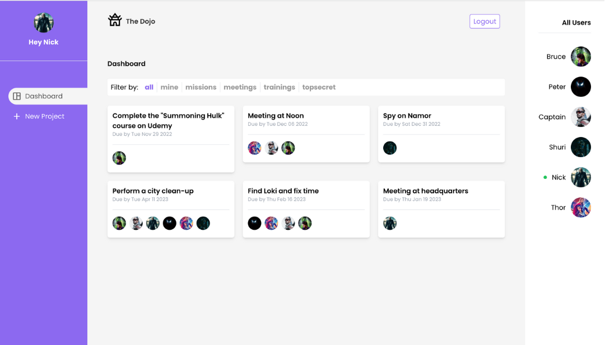
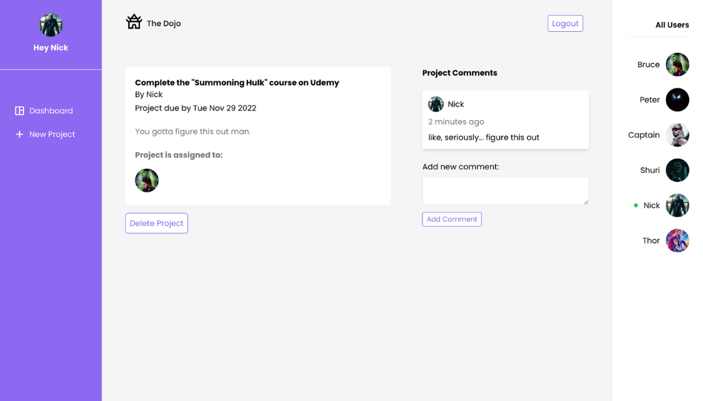

# The Dojo 

a project management app designed to allow teams to assign and complete tasks collaboratively. 

  

## General Info
This app creates an environment for teammates to collaborate effectively. Users are able to create tasks, assign them to specific team members and collaborate through comments. Once a task is completed, the creator of that task is able to delete it. Green circles will appear near a user's thumbnail if they are logged on.  

## Technologies
The Dojo was created with:
* React version: 17.0.2
* Firebase version: 8.5.0
* Tailwind version: 3.1.4

## Launch
The Dojo was deployed using firebase; simply click the following link: https://thecrmsite.web.app/

Feel free to sign up using a random email and password.

You can also log in using:
email: nick@marvel.com
pw: nickfury
